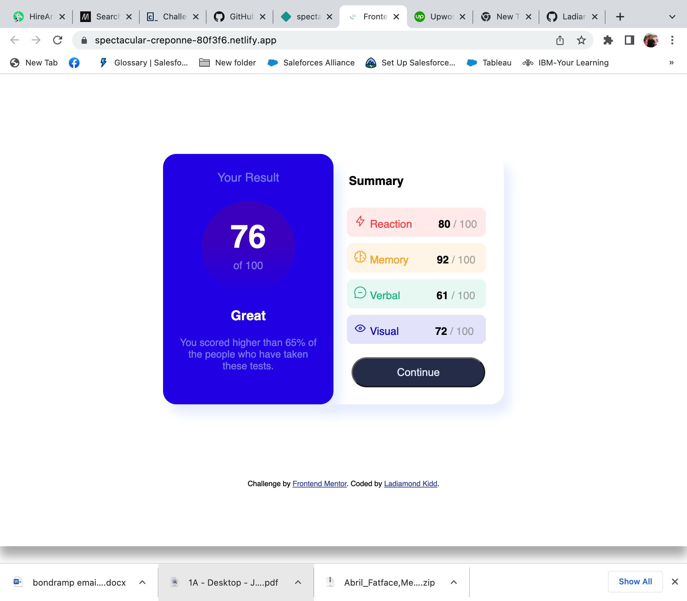
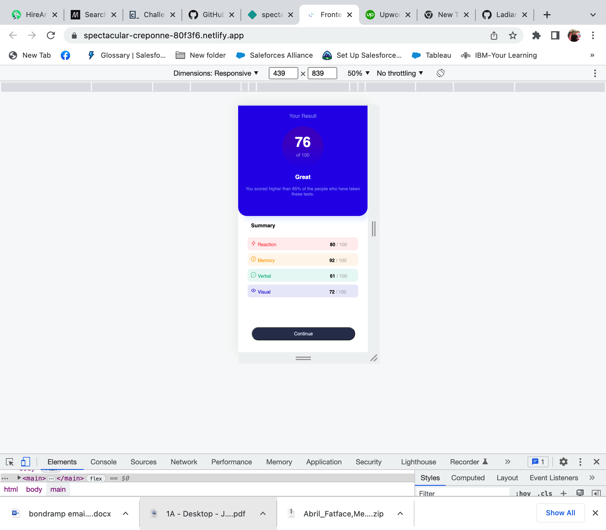

# Frontend Mentor - Results summary component solution

This is a solution to the [Results summary component challenge on Frontend Mentor](https://www.frontendmentor.io/challenges/results-summary-component-CE_K6s0maV). Frontend Mentor challenges help you improve your coding skills by building realistic projects. 

## Table of contents

- [Overview](#overview)
  - [The challenge](#the-challenge)
  - [Screenshot](#screenshot)
  - [Links](#links)
- [My process](#my-process)
  - [Built with](#built-with)
  - [What I learned](#what-i-learned)
- [Author](#author)

## Overview

### The challenge

Users should be able to:

- View the optimal layout for the interface depending on their device's screen size
- See hover and focus states for all interactive elements on the page

### Screenshot

### Links

- Solution URL: [Github Repository](https://github.com/Ladiamondk/Results-Project)
- Live Site URL: [Live site](https://spectacular-creponne-80f3f6.netlify.app/)

## My process
- Identify elements to determine HTML layout/structure
- Set elements background-colors so I can see and set measurements / placement
- Place all selectors on CSS file
- cneter using flex
- applied box-shadowing: (x, y, radius, color)
- worked on left component
  - focused on placement
  - applied features / font, size, weight
- worked on right component
- work o @media rulesets

### Built with

- Semantic HTML5 markup
- CSS custom properties
- Flexbox

### What I learned
- display: flex; align-items: center; justify-content: center; allows for centers contents inside elements
- background-linear: (btttm/color, top/colo) = applies a transitional appears to colors defined in elements
- border-collapse: collapse = in tables allows you to add and adjust padding in td
- in tables to create space in between cells thicken the border
## Author

- Website - [Ladiamond Kidd](https://www.your-site.com)

